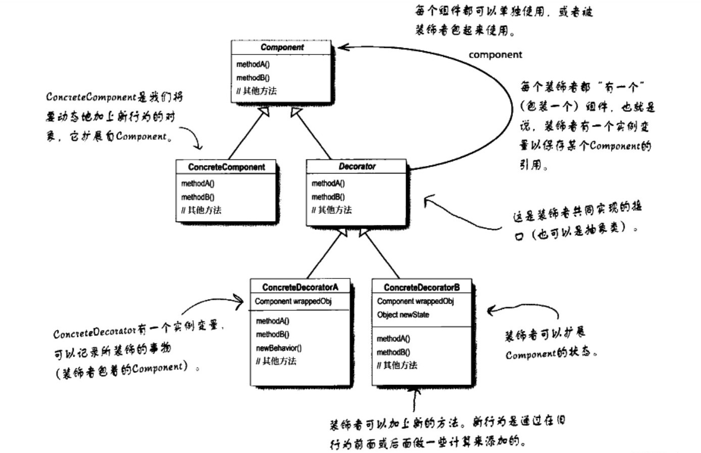
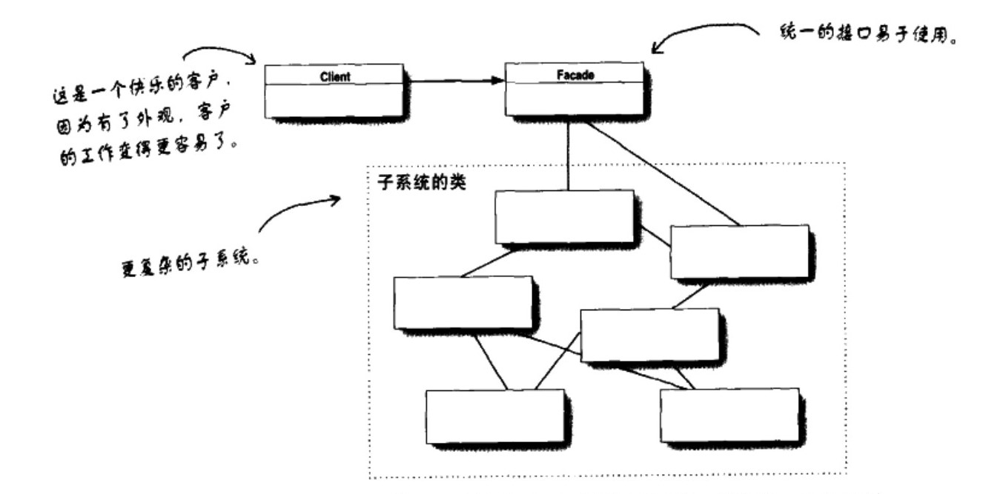

# 结构型设计模式

> 如何组合各种对象以便获得更好、更灵活的结构.
>
> 结构型模式不仅仅简单地使用继承，而更多地通过组合与运行期的动态组合来实现更灵活的功能

## 1.装饰者模式

> 参考: FilterInputStream
>
> 装饰者和被装饰者具有相同的超类.
>
>    	1. 在需要**装饰者**的地方, 可以用被装饰过的对象替换.
>    	2. 可以住在多层包装.
>    	3. 装饰者通过重写特定方法, 增加具体的逻辑. 

- `Component`: 抽象构建, 表示规范准备接收附加责任的对象.
- `ConcreteComponent extends Component`: 具体构建, 被装饰对象.
- `Decorator extends Component`: 装饰器, 继承抽象构建, 并需要一个构造函数, 传入`Component`对象.
- `ConcreteDecorator`: 具体装饰器.
- 

```java
/* 抽象构建 */
abstract class Component {
  public abstract void operation();
}

/* 具体构建, 继承抽象构建的具体类. 实现抽象方法 */
class ConcreteComponent extends Component {
  @Override
  public void operation(){
    System.out.println("...");
  }
}

/* 装饰器, 继承抽象构建(里氏替换原则) */
class Decorator extends Component {
  /* 保存需要装饰的具体构建(protected 保证子类可以访问) */
  protected Component component;
  public Decorator(Component component) {
    this.component = component;
  }
}

/* 具体装饰器(ConcreteDecorator)通过重写该方法, 可以在父类方法基础上, 做出额外操作 */
class ConcreteDecorator extends Decorator{

  @Override
  public void operation(){
    this.component.operation();
  }
}
```

## 2.适配器模式

> 将一个类的接口, 转换为客户期望的另一个接口.
>
> 将一个不兼容的对象用是适配器包装起来, 通过适配器对外提供兼容接口.

## 3.外观模式

> 改变接口的目的是为了简化接口.
>
> 外观模式定义了一个高层接口, 让子系统更容器使用.

- 

## 4.代理模式

### 1.静态代理

- 为每个类编写一个**对应的代理类**, 并且让代理类实现和目标类相同的接口.

- 代理对象 = 增强代码+ 目标对象

- 缺陷: 要手动为每一个目标类编写对应的代理类

### 2.动态代理

- 通过`Proxy.newProxyInstance(ClassLoader loader, Class<?>[] interfaces, InvocationHandler h)`创建接口(interfaces)对应的代理类.
    - `loader = target.getClass().getClassLoader()`
    - `interfaces = target.getClass().getInterfaces()`
- 动态代理可以在不扩展代码的情况下, 为不同的类, 不同的接口提供相同的功能扩展.