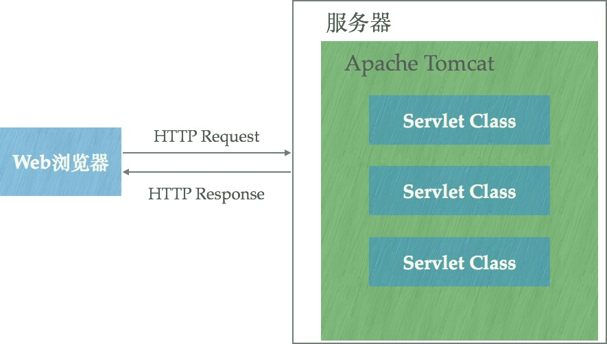

# 前后端的一些概念

## 1.后端服务器

### 1.网关协议

> [参考](https://www.biaodianfu.com/cgi-fastcgi-wsgi.html)：(Common Gateway Interface） (可以参看《Python核心编程 10章》)
>
> 由服务端脚本根据请求内容动态生成页面返回

- **CGI**：Common Gateway Interface，外部应用程序（`CGI`程序）与Web服务器之间的接口标准，是在`CGI`程序和Web服务器之间传递信息的规程，Web服务器可以让CGI外部程序根据Web请求生成动态内容；

    - 针对每次请求都会创建进程，用完抛弃。效率低；解决方式有两个：1.服务集成，2.外部进程（FastCGI）；

    

- **FastCGI** ：从CGI发展改进而来，外部进程，CGI应用在服务器外部，当有请求进入时，服务器将这个请求传递(**进程间通信, 例如域套接字**)到外部进程中。 

- **WSGI**：Web服务器网关接口（Python Web Server Gateway Interface，缩写为WSGI）是为Python语言定义的**Web服务器**和**Web应用程序或框架**之间的一种简单而**通用的接口**。

    - WSGI 不是服务器，也不是用于程序交互的API，更不是真实的代码，只是定义的一个接口；
    - 目标是在web服务器和web框架层之间提供一个通用的API标准。
    - WSGI，规定，应用是可调用的对象 ，参数固定为：1.含有服务器环境变量的字典，2.另一个是可调用对象，该对象使用HTTP状态码和会返回给客户端HTTP头来初始化响应。例如`def simple_wsgi_app(environ, start_response):`
    - `environ`：服务器环境和请求信息的集合；
    - `start_response`: 服务器提供的回调, 将HTTP状态和头部发送到服务器;

- Web编程脚本语言：PHP/ASP/JSP

    - CGI效率低，需要组织处理大段的HTML；

    - 可以利用脚本语言+模板+动态数据的形式解决；

        

### 2.服务端架构

- MVC：

    - 模型`Model`用于封装与业务逻辑相关的数据和数据处理方法，视图`View`是数据的HTML展现，控制器`Controller`负责响应请求，协调`Model`和`View `；

        

- `REST`：Representational State Transfer ，表述性状态传递；

    - REST鼓励基于`URL`来组织系统功能，充分利用HTTP本身的语义，而不是仅仅将HTTP作为一种远程数据传输协议。Web应用的开发应该回归Web的本质特征。 

- 前端MVC：Angular/Backbone

    - 这种模式下，前后端的分工非常清晰，前后端的关键协作点是 Ajax 接口，规定好交互接口后，前后端工程师就可以根据约定，分头开工，开发环境中通过**Mock**等方式进行测试，同时在特定时间节点进行前后端集成测试。 

    - 前端代码膨胀，负责复杂的业务逻辑；典型框架有：`BackboneJS`, `AngularJS`, `EmberJS`, `KnockoutJS `

        

- JavaScript在服务器端:Node

    

### 3.Apache, Nginx, Apache Tomcat

> HTTP服务器：本质上也是应用程序，它通常运行在服务器上，绑定服务器IP并监听某个端口来接收并处理HTTP请求；  典型的有：Apache，Nginx；另外，很多编程语言都实现了简单的HTTP服务器例如python的`Python SimpleHTTPServer`；通常这些服务器只能返回静态内容，为了提供动态内容相关技术有：CGI，Java Servlet，FastCGI ，WSGI等；

- Apache：这里指，Apache HTTP Server Project，也就是HTTP服务器

    - 一般用于处理静态资源；
    - 动态资源请求一般通过：CGI、FASTCGI、等调用PHP脚本处理；

- Nginx：HTTP和反向代理服务器，通用TCP/UDP 代理服务器；

    - 一般用于处理静态资源；本身不支持生成动态页面，
    - 可以做反向代理；

- Apache Tomcat：能够动态生成资源并返回到客户端；

    - Servlet：Java接口, 相当于约定了处理方法和格式；

    - JSP（Java Server Pages）：对`Servlet`更高的抽象，帮助开发者基于`HTML/XML` 来动态生成Web页面内容，

    - Tomcat 就是**支持运行`Java Servlet/JSP `应用程序的容器（Container）**，让Java web app跑在里面；

    - Tomcat 运行在JVM上，绑定IP并监听端口，

        

### 4.服务降级与熔断

- 服务熔断: 当下游服务因为某种原因突然变得不可用或响应过慢, 上游服务为了保证自己整体服务的可用性, 不在继续调用目标服务, 直接返回.
- 服务降级: 当下游服务因为某种原因突然响应过慢, 下游服务主动停掉一些不太重要的服务, 释放服务器资源, 增加响应速度; 上游服务主动调用本地的降级逻辑, 避免卡顿.

### 5.API网关

> 微服务场景下, 1.服务比较分散, 一个前端业务通常需要同时调用多个服务(发送多次请求), 才能获取数据, 2. 微服务使用协议可能不一致(http, rpc), 有些对于浏览器不友好. 3. 每个请求一般都需要进行鉴权, 限流, 降级, 监控, 负载均衡等等.
>
> 基于上述原因, 引入**API网关**: 对内, 整合所有业务都需要的处理逻辑(鉴权, 限流...), 对外, 提供整合的, 协议一致性的服务.

### 6.分布式系统间的通信

- RPC: 远程过程调用
    - 实现目的: 要像本地调用函数一样调用远程函数;
    - RPC框架需要实现[参考](<https://www.zhihu.com/question/25536695/answer/221638079>):
        - a.Call ID映射: 调用时, 通用ID, 找到需要调用的函数;
        - b. 序列化和反序列化: 不同编程语言, 不同通信格式之间的转换;
        - c. 网络传输: 基于什么协议, 大部分是基于TCP,  也可用HTTP;
    - 
- Restful
    - 对接口的规范定义;
    - 

> 微服务之间的通信方式有: Restful, RPC
>
> 微服务调用为什么使用RPC? [参考](<https://zhuanlan.zhihu.com/p/61364466>)
>
> 1. RPC要解决的问题: a.分布式系统中, 服务间的调用问题; b. 远程调用时, 要能够像本地调用一样方便;
>
> =======

## 2.前端架构

#### 1.MVC

> [参考](<https://draveness.me/mvx>), 

- Model(模型), View(视图), Controller(控制), 不同的组件对其实现有很多不同;

- 软件设计分三层:

    - View: 面向最终用户, 提供界面;
    - Controller: 控制层, 接受用户输入, 操作 View 和 Model,
    - Model: 管理用户的行为和数据

- 维基中的MVC, 所有通信为单项通信, View --> Controller --> Model

    

#### 2.MVP

- 将mvc中的`Controller`替换为`Presenter(主持人)`, 很多逻辑放到`Presenter`层中;

- `View`为被动视图, 没有主动性

- IOS MVC

    

#### 3.MVVM

- 将`present`改为`ViewModel`, 唯一区别是, 采用双向绑定, `View`的改变会自动反应在`ViewModel`上;

    

